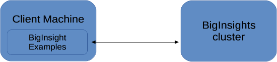

## Example projects for 'BigInsights for Apache Hadoop' on IBM Bluemix

This repository contains example projects for [BigInsights](https://console.ng.bluemix.net/catalog/services/biginsights-for-apache-hadoop).  

**NOTE:** If you are looking for examples for new IBM Analytics Engine service, these examples are being developed here: https://github.com/snowch/IBM_Analytics_Engine_Examples

Following the steps below on your client machine, it should take you less than 5 minutes to run any of the example projects against a BigInsights cluster. The projects are tested on [BigInsights on IBM Bluemix](https://console.ng.bluemix.net/catalog/services/biginsights-for-apache-hadoop) but they should also work for BigInsights on-premise.  Note that all of the examples are community supported.

The core idea is that you can run an example project to see it working against your BigInsights cluster. You can then copy the project and adapt it to add your own custom logic.  Think of the example projects as working blueprints.

**IMPORTANT:** Please vote for the following [Data Science Experience](http://datascience.ibm.com/) functionality that will replace this Zeppelin installation with an officially supported integration of notebooks with BigInsights:

- [Integrate BigInsights with DSX](https://datascix.uservoice.com/forums/387207-general/suggestions/16274593-integrate-with-biginsights)
- [Include Zeppelin notebooks on DSX](https://datascix.uservoice.com/forums/387207-general/suggestions/15192399-add-zeppelin-notebooks)

*********************************************************************

### Pre-requisites

- A client machine (e.g. laptop) connected to the internet
- A BigInsights cluster *([Bluemix](https://new-console.ng.bluemix.net/docs/services/BigInsights/index.html) setup instructions, [YouTube](https://youtu.be/t1Nuy_zrL7U) tutorial)*
- Java 8 JDK (not JRE) installed on your client machine *([OS X](https://docs.oracle.com/javase/8/docs/technotes/guides/install/mac_jdk.html#CHDBADCG) / [Linux](https://docs.oracle.com/javase/8/docs/technotes/guides/install/linux_jdk.html#BJFGGEFG) / [Windows](https://docs.oracle.com/javase/8/docs/technotes/guides/install/windows_jdk_install.html#CHDEBCCJ) installation instructions)*
- Git application installed on your client machine *([Linux / OS X / Windows](https://git-scm.com/book/en/v2/Getting-Started-Installing-Git) installation instructions)*

NOTE:
- You do NOT need to install gradle, the gradlew scripts mentioned below will install gradle for you
- Some examples may not work if you connect to the Internet through a non-transparent proxy server 

*********************************************************************

### Setup Instructions

Follow these steps on your client machine.  If you encounter an issue, see the [FAQ](./FAQ.md) for common issues and their resolution.

- Clone this repository `git clone https://github.com/IBM-Bluemix/BigInsights-on-Apache-Hadoop.git`
- Change into the directory of the cloned repository `cd BigInsights-on-Apache-Hadoop`
- Copy `connection.properties_template` to `connection.properties`
- Edit `connection.properties` to add your connection details for BigInsights
- In `connection.properties` uncomment the line `# known_hosts:allowAnyHosts`
- Download the cluster ssl certificate
  - Run `./gradlew DownloadCertificate` (OS X / *nix) 
  - Run `gradlew.bat DownloadCertificate` (Windows)
- Download libraries from the cluster
  - Run `./gradlew DownloadLibs` (OS X / *nix)
  - Run `gradlew.bat DownloadLibs` (Windows)

Next, see the section below for details of running an example script.

*********************************************************************
### Running the examples

After performing the above setup steps, you can look at the README.md file for the example you wish to run to find:

- more information describing the purpose of the example
- detailed instructions for running the example

See the list of examples [here](examples/README.md). 

*********************************************************************

### Getting Help

Find us on [Stack Overflow](https://stackoverflow.com/questions/tagged/biginsight-examples)

*********************************************************************

### Contributing updates to the guidelines

To update the guidelines, please fork the repository, make changes, and create a pull request.

