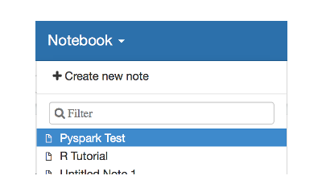
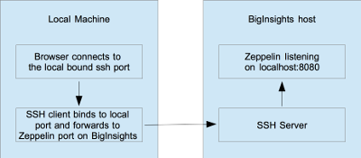

## Overview

This example installs, configures and runs [Zeppelin](https://zeppelin.apache.org) on a BigInsights cluster without requiring root privileges.  Two reasons for running Zeppelin may be:

- to provide data scientists with notebook functionality
- to provide example code in the form of notebooks for services such as hbase

### Security notice

The Installation of Zeppelin will result in Zeppelin server listening for connections on all interfaces on port 8080 (the port can be changed as described [here](#install-zeppelin)) on the cluster mastermanager.  BigInsights for Apache Hadoop on IBM Bluemix is hidden by a firewall and Zeppelin can only be accessed on client machines using a SSH tunnel ([more info](#decomposition-instructions)). The SSH tunnel is setup for you when you execute the ([Run](#run-zeppelin)) target.  The SSH tunnel ensures only users can only access Zeppelin if they have the credentials to log in via SSH.  

**WARNING:** If you are installing Zeppelin on an on-premise BigInsights cluster ensure you firewall the port exposed by Zeppelin.


## User experience

Users will gain the most from these examples if they are:

- Comfortable using Windows, OS X or *nix command prompts

## Example Requirements

- You meet the [pre-requisites](../../README.md#pre-requisites) in the top level [README](../../README.md)
- You have followed the [setup instructions](../../README.md#setup-instructions) in the top level [README](../../README.md)
- You need to ensure you have the appropriate services running on your cluster for the interpreters you wish to use (e.g. Spark)

## Run the example

### Install Zeppelin

To install Zeppelin, first copy the file `zeppelin_env.sh_template` to `zeppelin_env.sh`.  Ensure that the value for `ZEPPELIN_PORT` is set a port that is available on the cluster.  If other users have already installed Zeppelin on this cluster, you will need probably need to change the `ZEPPELIN_PORT`.

Next open a command prompt window:

   - change into the directory containing this example and run gradle to execute the example
      - `./gradlew Install` (OS X / *nix)
      - `gradlew.bat Install` (Windows)
   - some output from running the command on my machine is shown below 

```bash
biginsight-bluemix-docs $ cd examples/Zeppelin
biginsight-bluemix-docs/examples/Zeppelin $ ./gradlew Install
:CreateTruststore
>> Remove truststore
>> Create truststore
:Install
...
BUILD SUCCESSFUL
```

### Uninstall Zeppelin

To uninstall Zeppelin, in a command prompt window:

   - change into the directory containing this example and run gradle to execute the example
      - `./gradlew Uninstall` (OS X / *nix)
      - `gradlew.bat Uninstall` (Windows)
   - some output from running the command on my machine is shown below 

```bash
biginsight-bluemix-docs $ cd examples/Zeppelin
biginsight-bluemix-docs/examples/Zeppelin $ ./gradlew Uninstall
:Uninstall
...
BUILD SUCCESSFUL
```

### Run Zeppelin

First install Zeppelin.  Then to run Zeppelin, in a command prompt window:

   - change into the directory containing this example and run gradle to execute the example
      - `./gradlew Run` (OS X / *nix)
      - `gradlew.bat Run` (Windows)
   - some output from running the command on my machine is shown below 

```bash
biginsight-bluemix-docs $ cd examples/Zeppelin
biginsight-bluemix-docs/examples/Zeppelin $ ./gradlew Run
:Run
Strict host key checking is off. It may be vulnerable to man-in-the-middle attacks.
bicluster#0|Zeppelin is running                            [  OK  ]
bicluster#0|
> Building 0% > :Run

SSH forwarding localhost:51174 -> BigInsights zeppelin
Access zeppelin at: http://localhost:51174.
Press ENTER to quit.
```

Follow the instructions output by the Run command.  

### Zeppelin daemon: stop, start, status, restart

You can check the status of the Zeppelin daemon by running `./gradlew -q status`

```bash
$ ./gradlew -q status
bicluster#1|Zeppelin is running                            [  OK  ]
bicluster#1|
```

You can stop the Zeppelin daemon with `./gradlew -q stop`

```bash
$ ./gradlew -q stop
bicluster#1|Zeppelin stop                                  [  OK  ]
```

and start the Zeppelin daemon with `./gradlew -q start`

```bash
$ ./gradlew -q start
bicluster#1|Zeppelin start                                 [  OK  ]
bicluster#1|
```
and restart Zeppelin daemon with `./gradlew -q restart`

```
$ ./gradlew -q restart
bicluster#1|Zeppelin stop                                  [  OK  ]
bicluster#1|Zeppelin start                                 [  OK  ]
```

### Test Zeppelin with Pyspark

First run Zeppelin, Then click on the Notebook dropdown menu from the main toolbar and click on the Pyspark Test notebook:



- Click on the 'Pyspark Test' notebook to open it
- Click on the run button in the notebook windows to execute the notebook code 
- Verify the row count output from spark equals the expected row count

You should also be able to see the above spark job running on the spark cluster.  While the notebook is running, you could ssh into the cluster and run the command `yarn application -list`.  

**NOTE**: The spark yarn application should remain in RUNNING state until it is explicilty closed or Zeppelin is restarted. 

### Test Zeppelin with SparkR

Similar to the instructions for 'Test Zeppelin with Pyspark', there is a notebook 'SparkR Test'.

## Decomposition Instructions

The examples uses a gradle build file [build.gradle](./build.gradle) when you run ./gradlew or gradle.bat. The build.gradle for this 'Run' target does the following:

- verifies that zeppelin has been installed on the cluster
- verifies if zeppelin is running on the cluster, if not zeppelin is not running it is started 
- sets up [port forwarding](https://en.wikipedia.org/wiki/Port_forwarding) on the local machine, see below



Port forwarding works as follows:

- the gradle ssh client binds to a random port on the local machine
- any traffic to this port on the local machine gets forwarded over ssh to the remote zeppelin port
- gradle prints the URL with the random local port on the local machine

Therefore, when you connect to this local URL you are really connecting to the zeppelin service on the cluster.  

## Limitations

- the following interpreters are configured:
  - spark (pySpark and sparkR)
  - livy (pySpark and sparkR)
  - sh
  - hive
  - bigsql (if the cluster has bigsql installed)
- each user needs to install zeppelin into their own account, by setting the ZEPPELIN_PORT to an available port on the cluster.
